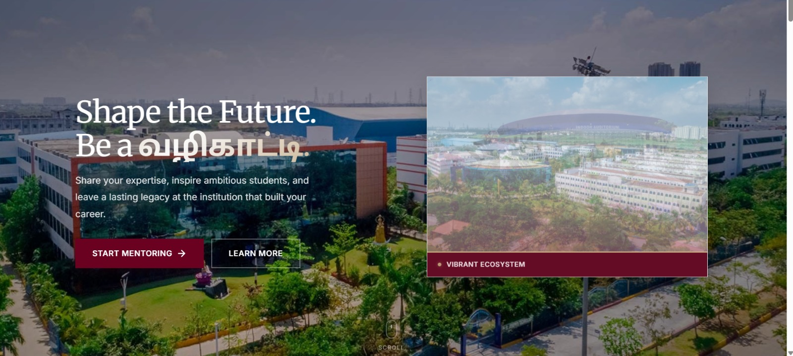
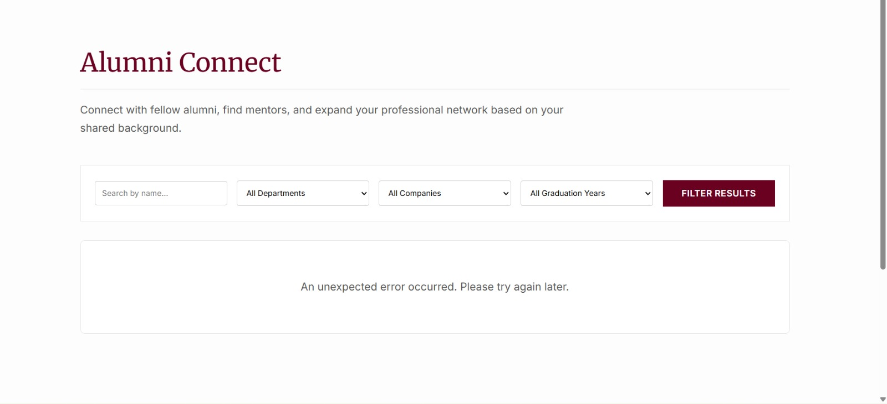
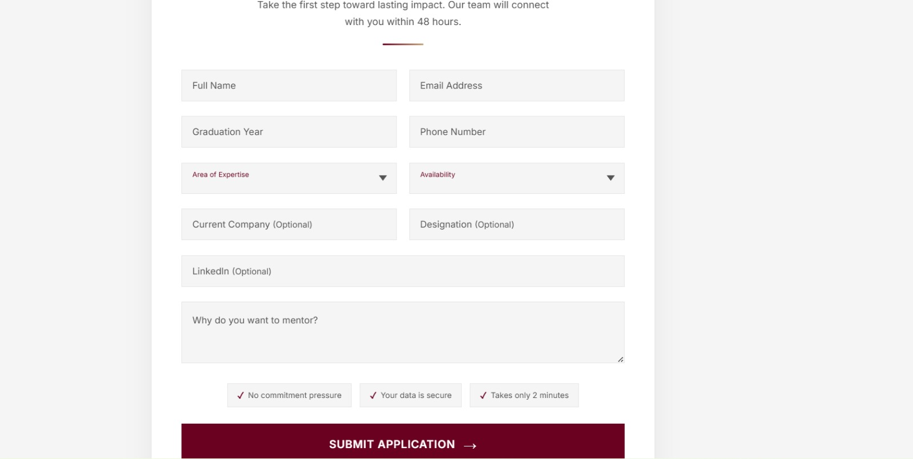
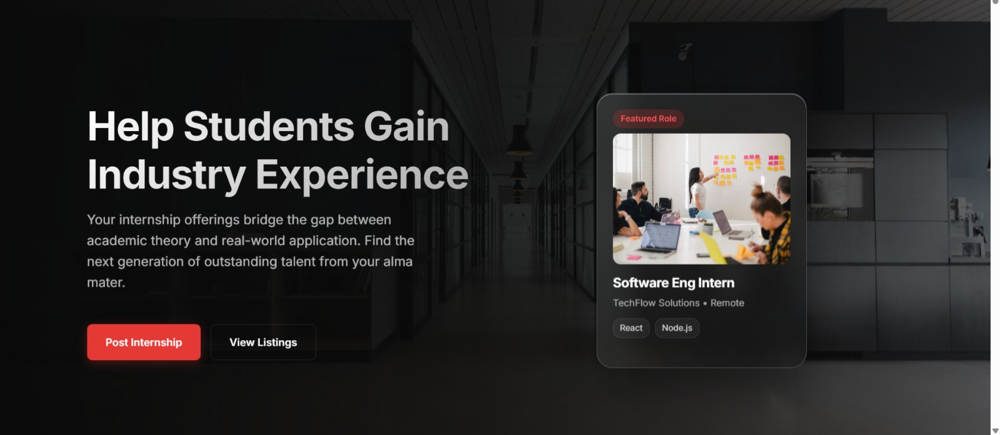

# 🎓 Alumni Connect Platform

A modern web platform designed to connect students with alumni, enable mentorship opportunities, and bridge the gap between academia and industry.

---

## 📖 Overview

Alumni Connect is a centralized system where students can discover alumni, connect with mentors, and explore career opportunities.

This platform helps:
- Strengthen alumni-student relationships  
- Provide mentorship and career guidance  
- Enable internship and opportunity sharing  
- Build a strong professional network  

---

## ✨ Features

- 🔍 Alumni search with advanced filters (department, company, graduation year)
- 🤝 Alumni-to-student mentorship system
- 📝 Mentor application form
- 💼 Internship posting & opportunity section
- ⚡ Dynamic data integration using Supabase
- 📱 Fully responsive UI design

---

## 🛠️ Tech Stack

**Frontend**
- HTML
- CSS
- JavaScript

**Backend / Database**
- Supabase

---

## 📸 Screenshots

### 🏠 Landing Page


---

### 🔍 Alumni Search & Filters


---

### 📝 Mentorship Application Form


---

### 💼 Internship & Opportunities Section


---

## ⚙️ Installation & Setup

1. Clone the repository:
```bash
git clone https://github.com/sujitvinu123/clg.git
